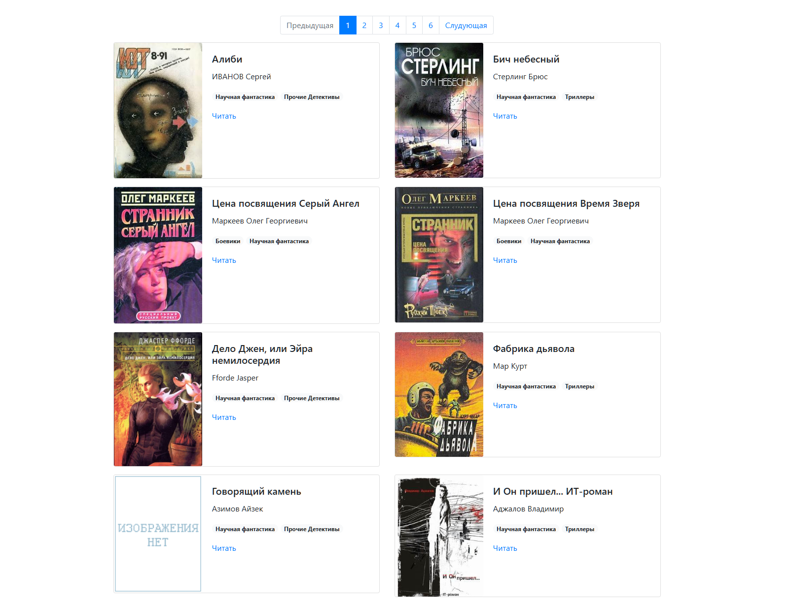

# Онлайн библиотека



Посмотреть больше можно перейдя по [ссылке](https://stmkv.github.io/online_library_bootstrap/pages/index1.html).

## Как запустить

Чтобы запустить необходимо скачать исходный код, после чего установить все зависимости. Python3 или выше уже должен быть установлен.

```
pip install -r requirements.txt
```

После чего необходимо выполнить команду

```
python render_websyte.py
```

Все необходимые файлы программа ищет в корневом директории проекта `books`

Когда программа будет запущена вы сможете найти сайт по адресу [http://127.0.0.1:5500/pages/index1.html](http://127.0.0.1:5500/pages/index1.html)

Если есть необходимость запустить сайт офлайн, то можно открыть файлы `index<номер страницы>.html` в корневой папке `pages`

## Загрузка других книг

Если есть необходимость скачать больше книг, можно воспользоваться [скриптом](https://github.com/Stmkv/online_library_parser).
